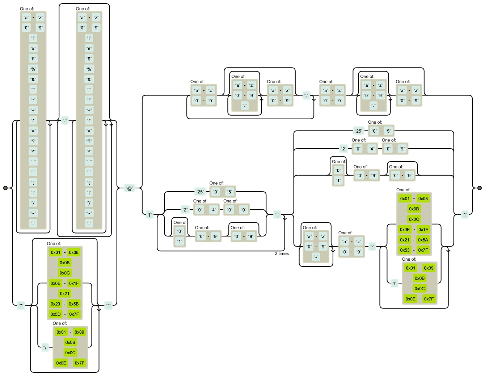

# **EPIC APIS DATABASE**

[VISIT EPIC APIS LIVE](https://epicapis.latoniamertica.dev/)
<br>
[VISIT EPIC APIS SERVER LIVE](https://epicapis-backend.latoniamertica.dev/)

##### [epic apis summary](epic-apis-summary.pdf)

##### [epic apis data flow](epicapis-dfd.pdf)

###### **note:** this is more accurately a process/data flow diagram

##### [frontend github repo](https://github.com/LaTonia-Mertica/epicapis)

##### [backend github repo](https://github.com/LaTonia-Mertica/epicapis-db)

<br>

### **BASIC SETUP**

- install body parser, cors, express, nodemon, sendgrid

- in app/index/server file, _add requires_

  - const express = require("express");
  - const cors = require("cors");
  - const bodyParser = require("body-parser");
  - const apiKey = require("./sendgridkey");
  - const sgMail = require("@sendgrid/mail");

- in app/index/server file, _assign server_

  - const server = express();

- in app/index/server file, _arrange to use_

  - server.use(cors());
  - server.use(bodyParser.json());

- in app/index/server file, _pass api key_ per sendgrid api documentation

  - sgMail.setApiKey(apiKey);

  <br>

  ##### **note:** the requires method was replaced with the export/import method aka edited from common JS to ES5/ES6

  <br>

### **SENDGRID**

an email application programming interface. also known as Twilio SendGrid.

per wikipedia, "_SendGrid provides a cloud-based service that assists businesses with email delivery. The service manages various types of email including shipping notifications, friend requests, sign-up confirmations, and email newsletters. It also handles Internet service provider (ISP) monitoring, domain keys, sender policy framework (SPF), and feedback loops. Additionally, the company provides link tracking, open rate reporting. It also allows companies to track email opens, unsubscribes, bounces, and spam reports. Beginning in 2012, the company integrated SMS, voice, and push notification abilities to its service through a partnership with Twilio._"

  <br>

### **BASIC SENDGRID STRUCTURE**

```
server.post("/sendEmail", (req, res) => {
  const msg = {
    to: "epicapis+1@latoniamertica.dev",
    from: "epicapis@latoniamertica.dev",
    subject: "Your EPIC API Selections",
    html: `Thank you for visiting Epic Apis. Selections you submitted are outlined below:`,
  };
  (async () => {
    try {
      await sgMail.send(msg);
      console.log("Email sent");
    } catch (error) {
      console.error(error);

      if (error.response) {
        console.error(error.response.body);
      }
    }
  })();
});
```

  <br>

### **BASIC GENERAL REGEX TO CHECK EMAIL STRUCTURE**

`/(?:[a-z0-9!#$%&'*+/=?^_`{|}~-]+(?:\.[a-z0-9!#$%&'*+/=?^_`{|}~-]+)_|"(?:[\x01-\x08\x0b\x0c\x0e-\x1f\x21\x23-\x5b\x5d-\x7f]|\\[\x01-\x09\x0b\x0c\x0e-\x7f])_")@(?:(?:[a-z0-9](?:[a-z0-9-]*[a-z0-9])?\.)+[a-z0-9](?:[a-z0-9-]*[a-z0-9])?|\[(?:(?:25[0-5]|2[0-4][0-9]|[01]?[0-9][0-9]?)\.){3}(?:25[0-5]|2[0-4][0-9]|[01]?[0-9][0-9]?|[a-z0-9-]\*[a-z0-9]:(?:[\x01-\x08\x0b\x0c\x0e-\x1f\x21-\x5a\x53-\x7f]|\\[\x01-\x09\x0b\x0c\x0e-\x7f])+)\])/;
`

<br>

### **RAILROAD DIAGRAM OF ABOVE REGEX**



###### diagram source: emailregex.com

  <br>

### **PORT: PASS DIRECTLY VERSUS INDIRECTLY**

`let PORT = 3001;` is a bit more code while a cleaner way to pass the port to the node.js server.listen() method. this indirect way of passing the port is helpful for when the port needs to or will change.

**example:** `server.listen(PORT, () => { console.log("Running On Port " + PORT); });`

to pass the port directly simply do not assign the port to a variable. instead, add the port number as the first parameter in the server.listen() method and in every instance where the port is used. for example, in console.log() if the console log method includes the specific port in the output message.

**example:** `server.listen(3000, () => { console.log("Running On Port " + 3000); });`

  <br>

### **WIRING BACKEND TO FRONTEND**

` const msg =`<br>
&emsp;`{`<br>
&emsp;&emsp;`to: req.body.email,`<br>
&emsp;&emsp;`from: "from email address in here",`<br>
&emsp;&emsp;`subject: "subject line content in here",`<br>
&emsp;&emsp;`html,`<br>
&emsp;&emsp;... additional elements in here as needed (ie email attachments)<br>
&emsp;`};`

#### **FOLLOWED BY CODE BELOW**

`(async () => {`<br>
&emsp;`try {`<br>
&emsp;&emsp;`await sgMail.send(msg);`<br>
&emsp;&emsp;`console.log("Email Sent!");`<br>
&emsp;&emsp;`res.send({ success: true });`<br>
&emsp;`} catch (error) {`<br>
&emsp;&emsp;`res.send({ success: false });`<br>
&emsp;&emsp;`console.error(error);`<br>

&emsp;&emsp;`if (error.response) {` <br>
&emsp;&emsp;&emsp;`console.error(error.response.body);` <br>
&emsp;&emsp;`}` <br>
&emsp;`}` <br>
`})();`

<br>

### **BASIC STRUCTURE: ACCESS DATA FOR EMAIL**

##### **note:**<br>

##### 1. content in assignment for html variable must be in backticks,<br>

##### 2) drilling in to specific key beyond first two levels may be required,<br>

##### 3) include html formatting before and/or after content as desired

<br>

let html = `intro content for email body as desired`;

`if (req.body.variableNameHere.keyInVariableHere) {`<br>
&emsp;html += `${req.body.variableNameHere.keyInVariableHere`;<br> `} else {`<br> html += `...`; <br>
`}`

<br>

### **BASIC STRUCTURE: ACCESS DATA FOR EMAIL (w/DATA)**

let html = `<i>Thank you for visiting</i>&nbsp;<strong>EPIC APIS</strong>.&nbsp;<i>Selections submitted are below</i>:<br>`;<br>

`if (req.body.selections.beautifulEntry) {`<br>
&emsp;html += `<br><br><strong>Beautiful Code: </strong> ${req.body.selections.beautifulEntry.beautifulEntry}<br>`;<br> `} else {`<br> html += `<br><strong>Beautiful Code: </strong>Access the 'Beautiful Code' modal at Epic Apis online and add your own definition (<strong>note:</strong> you may adopt or adapt the default definition).<br>`;<br> `}`

<br>

### **BASIC SENDGRID FEATURES**

- [BASE64](https://www.w3docs.com/tools/image-base64) is the required format for images included in the email api<br>

- arrange a file system to include attachments in the email api<br>
  **1)** `const fs = require("fs");`<br>
  **2)** declare variable assigned to path to file attaching<br>
  **3)** declare variable assigned to `fs.readFileSync(step 2 variable here).toString("base64");`<br>

  ##### **note:** repeat steps 2-3 for each file being attached

  ##### **also note:** code refactor may be needed per deploy

  <br>

- in variable assigned to the message being sent via the email api, for example - `const msg = {}`, add among the comma-separated elements:<br>

  `attachments: [`<br>
  &emsp;`{`<br>
  &emsp;&emsp;`content: variable name from step 3,`<br>
  &emsp;&emsp;`filename: "name of file in here",`<br>
  &emsp;&emsp;`type: "application/file extension here",`<br> &emsp;&emsp;`disposition: "attachment",`<br>
  &emsp;`},`<br>
  &emsp;`{`<br>
  &emsp;&emsp;`content: next variable name from step 3,`<br>
  &emsp;&emsp;`filename: "next name of file in here",`<br>
  &emsp;&emsp;`type: "application/next file extension here",`<br>
  &emsp;&emsp;`disposition: "attachment",`<br>
  &emsp;`},`

  <br>

##### **unfortunate note:** gmail/google refuses to display custom logo in the bottom of emails recipients receive from epic apis. this form of censorship, implemented under the guise of blind 'safety' measure(s), is an example of a tech giant disregarding consumer rights **and** assuming they wholly define intellect.

<br>

##### i've been gradually leaving gmail/google, and offer the following article for insight from another like-minded individual: [How I Fully Quit Google (And You Can, Too)](https://medium.com/s/story/how-i-fully-quit-google-and-you-can-too-4c2f3f85793a)

<br>

### **DOCKER IMAGE / EPIC APIS DB CONTAINER**

1. visit [latoniamertica on docker hub](https://hub.docker.com/u/latoniamertica)
2. click on latoniamertica/epicapis-db
3. look to the right for Docker Pull Command
4. copy the Docker Pull Command
5. in your termina/CLI, paste the Docker Pull Command
6. the Docker Pull Command will be formatted as `docker pull` followed by the image name. for example, `docker pull latoniamertica/epicapis-db`
   <br>

##### **note:** you can skip steps 1 through 4 if you know the image name

<br>

7. run the command `docker run -p 3001:3001 -it latoniamertica/epicapis-db`. if successful, the terminal/CLI will note the port (in this example port 3001) where the server is running
   <br>

##### **more notes:** regarding ports, the first 3001 in 3001:3001 may be changed to specify a port on your local device (aka your Mac). however, the second 3001 in 3001:3001 must match what the author of the container listed for the container runtime port (in this case 3001).

<br>
